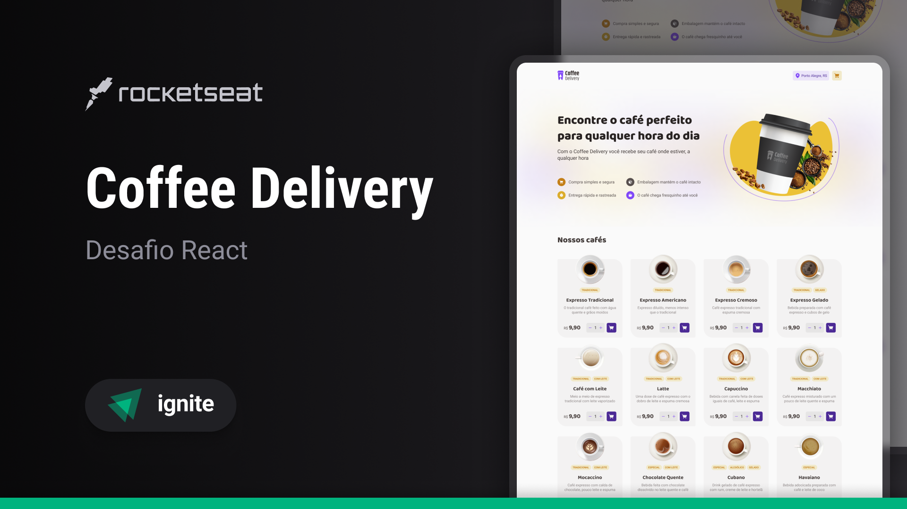

# Coffe Delivery

Este projeto foi criado para resolução de um desafio da formação de ReactJS da Rocketseat. As intruções do desafio podem ser acessadas [aqui](./challenge_instructions.md).

## Conceitos aplicados
- Estados
- Context
- LocalStorage
- Components
- Routes

## Tecnologias utilizadas
- ReactJS
- Vite
- Typescript
- React Router DOM
- React-Hook-Form
- Zod